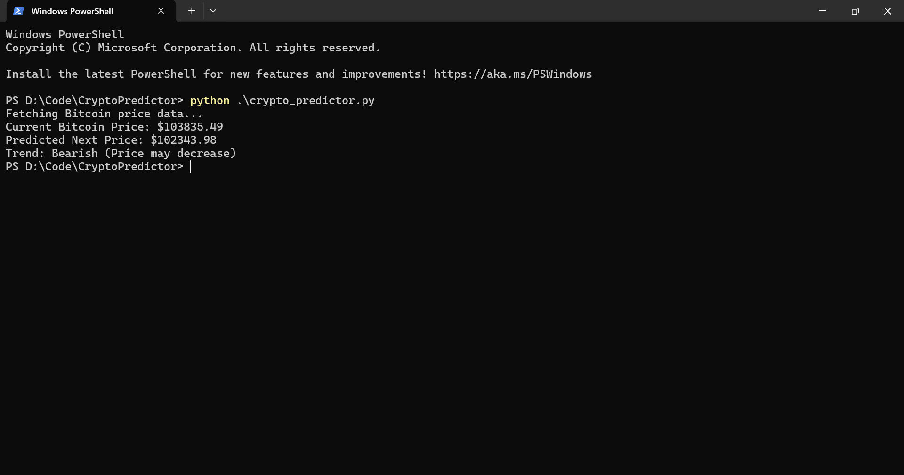

# Crypto Price Predictor
A Python tool to fetch real-time Bitcoin prices and predict the next price using linear regression.
## Features
- Fetches data from CoinGecko API
- Predicts next price with a simple model
- Indicates bullish, bearish, or neutral trends
## Screenshots

## How to Run
1. Install dependencies: `pip install requests scikit-learn`
2. Run `python crypto_predictor.py`
